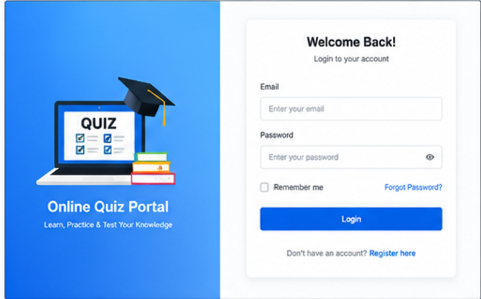
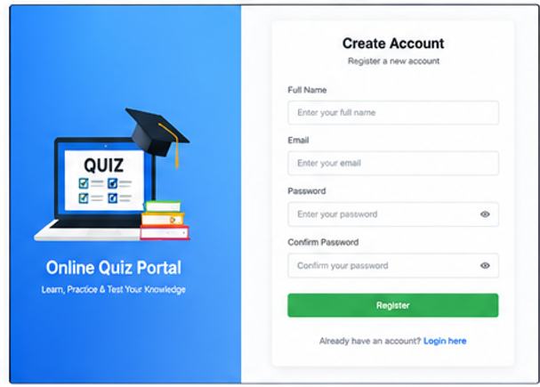
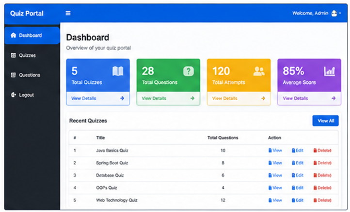
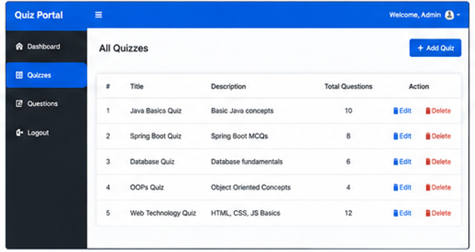
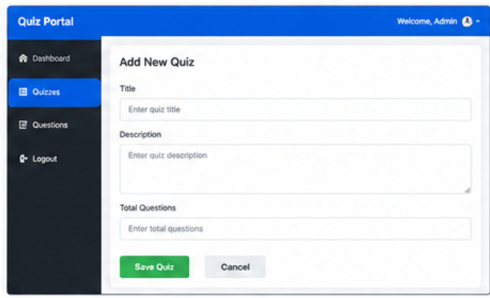
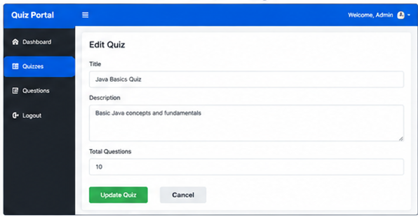
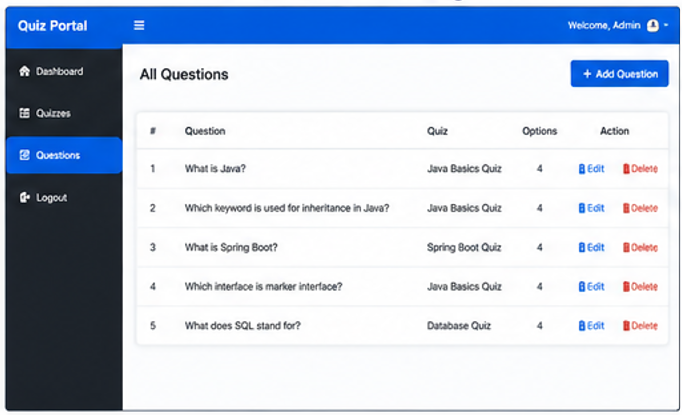
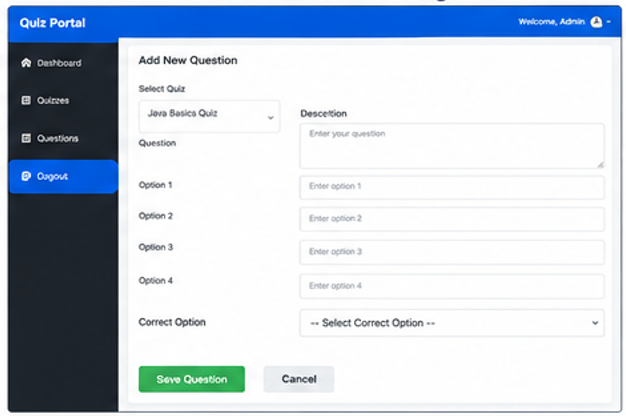
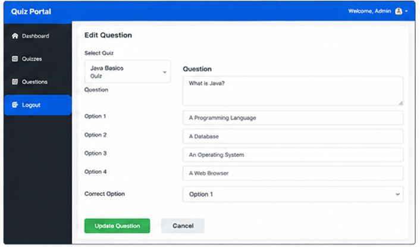

# 🎯 Online Quiz Portal


A full-stack **Online Quiz Portal** developed using **Spring Boot**, **Spring MVC**, **Thymeleaf**, and **MySQL**. This project provides an **Admin Panel** to manage quizzes and questions with complete CRUD operations through a clean and responsive web interface.

---

## 📌 Features

### 👤 User Module
- User Registration
- User Login
- Dashboard

### 📝 Quiz Management
- Add Quiz
- View All Quizzes
- Edit Quiz
- Delete Quiz

### ❓ Question Management
- Add Questions to Quiz
- View Questions
- Edit Questions
- Delete Questions

### 💾 Database
- MySQL Database
- Spring Data JPA
- Automatic CRUD Operations

---

# 🛠️ Technologies Used

| Technology | Description |
|------------|-------------|
| Java | Programming Language |
| Spring Boot | Backend Framework |
| Spring MVC | MVC Architecture |
| Spring Data JPA | Database Operations |
| Thymeleaf | Template Engine |
| MySQL | Database |
| Bootstrap 5 | Responsive UI |
| HTML5 | Frontend |
| CSS3 | Styling |
| Git & GitHub | Version Control |

---

# 📂 Project Structure

```
QuizPortalApplication
│
├── src
│   ├── controller
│   ├── entity
│   ├── repository
│   ├── service
│   ├── templates
│   └── static
│
├── images
│
├── pom.xml
│
└── README.md
```

---

# 📸 Application Screenshots

## 🔐 Login Page



---

## 📝 Registration Page



---

## 🏠 Dashboard



---

## 📋 Quiz List



---

## ➕ Add Quiz



---

## ✏️ Edit Quiz



---

## ❓ Question List



---

## ➕ Add Question



---

## ✏️ Edit Question



---

# 💽 Database

### Database Name

```
quizdb
```

### Tables

- users
- quizzes
- questions

---

# ⚙️ Installation

## 1️⃣ Clone Repository

```bash
git clone https://github.com/AaryanK47/QuizPortalApplication.git
```

---

## 2️⃣ Open Project

Open the project using:

- IntelliJ IDEA
- Eclipse

---

## 3️⃣ Configure Database

Open

```
src/main/resources/application.properties
```

Update the following values:

```properties
spring.datasource.url=jdbc:mysql://localhost:3306/quizdb
spring.datasource.username=root
spring.datasource.password=YOUR_PASSWORD_HERE
```

---

## 4️⃣ Run Application

Run

```
QuizPortalApplication.java
```

Open your browser:

```
http://localhost:8081
```

---

# 🚀 Future Enhancements

- Student Login
- Quiz Attempt Module
- Timer for Quiz
- Automatic Score Calculation
- Result Page
- Leaderboard
- Admin Analytics Dashboard
- User Profile
- Quiz Categories
- Search & Filter

---

# 👨‍💻 Author

**Aaryan Kumar**

GitHub:
https://github.com/AaryanK47

---

# ⭐ If you like this project

If you found this project useful, consider giving it a ⭐ on GitHub!
